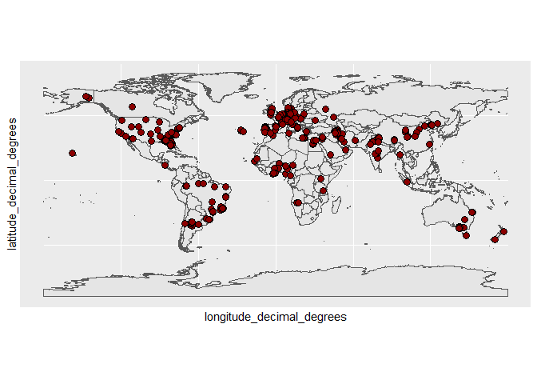
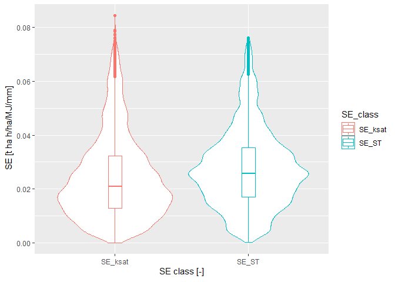
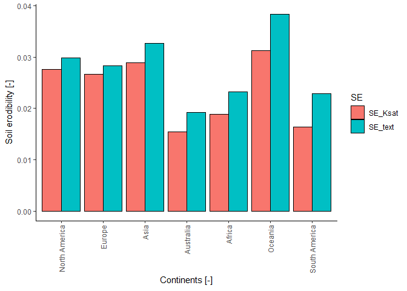
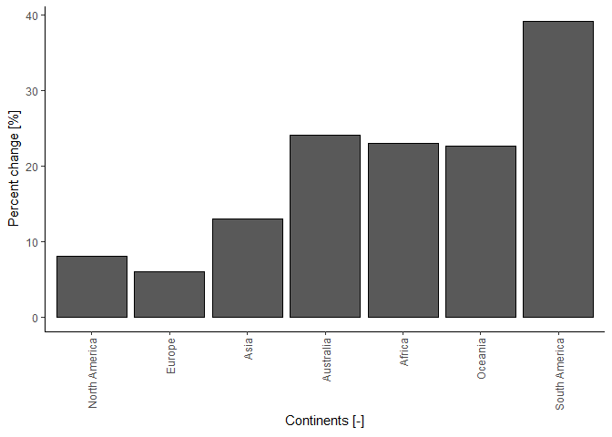

Global soil erodibility mapping data prepration
================
Surya Gupta, Pasquale Borrelli, Panos Panagos, and Christine Alewell

``` r
library(tidyr)
library(rgdal)
```

    ## Loading required package: sp

    ## Please note that rgdal will be retired by the end of 2023,
    ## plan transition to sf/stars/terra functions using GDAL and PROJ
    ## at your earliest convenience.
    ## 
    ## rgdal: version: 1.5-32, (SVN revision 1176)
    ## Geospatial Data Abstraction Library extensions to R successfully loaded
    ## Loaded GDAL runtime: GDAL 3.4.3, released 2022/04/22
    ## Path to GDAL shared files: C:/Users/surya/AppData/Local/R/win-library/4.2/rgdal/gdal
    ## GDAL binary built with GEOS: TRUE 
    ## Loaded PROJ runtime: Rel. 7.2.1, January 1st, 2021, [PJ_VERSION: 721]
    ## Path to PROJ shared files: C:/Users/surya/AppData/Local/R/win-library/4.2/rgdal/proj
    ## PROJ CDN enabled: FALSE
    ## Linking to sp version:1.5-0
    ## To mute warnings of possible GDAL/OSR exportToProj4() degradation,
    ## use options("rgdal_show_exportToProj4_warnings"="none") before loading sp or rgdal.

``` r
library(dplyr)
```

    ## 
    ## Attaching package: 'dplyr'

    ## The following objects are masked from 'package:stats':
    ## 
    ##     filter, lag

    ## The following objects are masked from 'package:base':
    ## 
    ##     intersect, setdiff, setequal, union

``` r
library(raster)
```

    ## 
    ## Attaching package: 'raster'

    ## The following object is masked from 'package:dplyr':
    ## 
    ##     select

``` r
library(ggplot2)
```

``` r
## Removing samples with no soil texture data
data<- read.csv("D:/Downloads_Surya/sol_ksat.pnts_horizons (10).csv/sol_ksat.pnts_horizons10.csv")

Data_sand<- data[!is.na(data$sand_tot_psa),]

Data_sand<- Data_sand[!Data_sand$tex_psda== "Error",]

data_clay<- Data_sand[!is.na(Data_sand$clay_tot_psa),]

data_silt<- data_clay[!is.na(data_clay$clay_tot_psa),]

#write.csv(data_silt,"C:/Users/surya/Documents/More_Ksat_dataset/Ksat_sand_silt1.csv")
```

``` r
##Adding soil samples from South America, Portugal in soilKsatDB dataset (Gupta et al., 2021)
##ALBA_Brazil samples

Janerio<- read.csv("C:/Users/surya/Documents/K_facor_modi/GTRJ_ALBA_Ksat.csv")

Janerio$Kfs_cm_day<- Janerio$Kfs_mm_h*2.4

Janerio$Kslab_cm_day<- Janerio$Kslab_mm_h*2.4

Janerio$OC<- Janerio$org_carb_g_kg/10

colnames(Janerio)[which(colnames(Janerio)%in% c("Upper_Hor"))]<- "hzn_top"

colnames(Janerio)[which(colnames(Janerio)%in% c("Lower_Hor"))]<- "hzn_bot"

colnames(Janerio)[which(colnames(Janerio)%in% c("LatitudeOR"))]<- "latitude_decimal_degrees"

colnames(Janerio)[which(colnames(Janerio)%in% c("LongitudeOR"))]<- "longitude_decimal_degrees"

colnames(Janerio)[which(colnames(Janerio)%in% c("sand_per"))]<- "sand_tot_psa"

colnames(Janerio)[which(colnames(Janerio)%in% c("silt_per"))]<- "silt_tot_psa"

colnames(Janerio)[which(colnames(Janerio)%in% c("clay_per"))]<- "clay_tot_psa"

colnames(Janerio)[which(colnames(Janerio)%in% c("OC"))]<- "oc_v"

colnames(Janerio)[which(colnames(Janerio)%in% c("Kslab_cm_day"))]<- "ksat_lab"

colnames(Janerio)[which(colnames(Janerio)%in% c("Kfs_cm_day"))]<- "ksat_field"

colnames(Janerio)[which(colnames(Janerio)%in% c("ID_GENERAL_OR"))]<- "ID"

colnames(Janerio)[which(colnames(Janerio)%in% c("bulk_den_g_cm3"))]<- "db"

colnames(Janerio)[which(colnames(Janerio)%in% c("texture"))]<- "tex_psda"

Janerio$hzn_depth<- (Janerio$hzn_top+Janerio$hzn_bot)/2

Janerio$source_db<- "Janerio_soils"

Janerio<- Janerio[,c("ID", "hzn_top", "hzn_bot", "latitude_decimal_degrees",
                     "longitude_decimal_degrees","silt_tot_psa","clay_tot_psa",
                     "db", "ksat_lab", "oc_v","sand_tot_psa","ksat_field",
                     "hzn_depth","source_db","tex_psda")]

#write.csv(Janerio,"C:/Users/surya/Documents/portugal_database/Janerio_mod.csv")

## portugal soils

portugal_soils<- read.csv("C:/Users/surya/Documents/portugal_database/Copy of PROPSOLO.csv")

portugal_soils<- portugal_soils[,c(1,2,3,4,5,6,11,12,13,14,15,16,29,31)]

portugal_soils$total<- portugal_soils$Coarse.Sand..2.0.2.mm.+ portugal_soils$Fine.sand..0.2.0.02mm.+portugal_soils$Silt..0.002.0.0002.mm.+portugal_soils$X.0.0002.mm
portugal_soils$sand<- portugal_soils$Fine.sand..0.2.0.02mm.+portugal_soils$Coarse.Sand..2.0.2.mm.

colnames(portugal_soils)[which(colnames(portugal_soils)%in% c("H.Depth.Top"))]<- "hzn_top"

colnames(portugal_soils)[which(colnames(portugal_soils)%in% c("H.Depth.Bottom"))]<- "hzn_bot"

colnames(portugal_soils)[which(colnames(portugal_soils)%in% c("Lat_dec"))]<- "latitude_decimal_degrees"

colnames(portugal_soils)[which(colnames(portugal_soils)%in% c("Long_dec"))]<- "longitude_decimal_degrees"

colnames(portugal_soils)[which(colnames(portugal_soils)%in% c("sand"))]<- "sand_tot_psa"

colnames(portugal_soils)[which(colnames(portugal_soils)%in% c("Silt..0.002.0.0002.mm."))]<- "silt_tot_psa"

colnames(portugal_soils)[which(colnames(portugal_soils)%in% c("X.0.0002.mm"))]<- "clay_tot_psa"

colnames(portugal_soils)[which(colnames(portugal_soils)%in% c("Organic.carbon...."))]<- "oc_v"

colnames(portugal_soils)[which(colnames(portugal_soils)%in% c("Ksmed"))]<- "ksat_lab"

portugal_soils$ksat_field<- "NA"

colnames(portugal_soils)[which(colnames(portugal_soils)%in% c("sample_id"))]<- "ID"

colnames(portugal_soils)[which(colnames(portugal_soils)%in% c("bulk.density"))]<- "db"

portugal_soils<- portugal_soils[!grepl("N", portugal_soils$ksat_lab),]

portugal_soils<- portugal_soils[!is.na(portugal_soils$latitude_decimal_degrees),]

portugal_soils$hzn_depth<- (portugal_soils$hzn_top+portugal_soils$hzn_bot)/2

portugal_soils$source_db<- "portugal_soils"

portugal_soils$tex_psda<- "NA"

portugal_soils<- portugal_soils[,c(1,3,4,5,6,9,10,11,13,14,16,17,18,19,20)]


#write.csv(portugal_soils,"C:/Users/surya/Documents/portugal_database/PROPSOLO_mod.csv")


Janerio_soils<- read.csv("C:/Users/surya/Documents/portugal_database/Janerio_mod.csv")

Janerio_soils<- Janerio_soils[,c("ID", "hzn_top", "hzn_bot", "latitude_decimal_degrees",
                                 "longitude_decimal_degrees","silt_tot_psa","clay_tot_psa",
                                 "db", "ksat_lab", "oc_v","sand_tot_psa","ksat_field",
                                 "hzn_depth","source_db","tex_psda")]


portugal_soils<- read.csv("C:/Users/surya/Documents/portugal_database/PROPSOLO_mod.csv")

## all_dataset

Ksat_data_our<- read.csv("C:/Users/surya/Documents/More_Ksat_dataset/Ksat_sand_silt1.csv")


Ksat_data_our<- Ksat_data_our[,c(2,8,9,4,5,16,15,11,20,18,17,21,26,22,14)]

Ksat_data_our1<- Ksat_data_our %>% filter( ID %in% c(378, 379, 380, 381, 382, 383, 384, 385, 386, 387, 388,
                                                     389, 390, 391, 392, 393, 973, 974, 975,976,
                                                     1711, 1712, 9045, 9046, 9047, 9966,9967, 9968,13021))
Ksat_data_our<-Ksat_data_our[!Ksat_data_our$ID%in% Ksat_data_our1$ID,]

## soilksatdb plus portugese soils

all_data<- rbind(Ksat_data_our, portugal_soils) 

all_data1<- rbind(all_data, Janerio_soils)

write.csv(all_data1,"C:/Users/surya/Documents/More_Ksat_dataset/Ksat_soilksatdb_portugal1.csv")
```

``` r
## Adding predicted OC values where values are missing
Ksat_data_our<- read.csv("C:/Users/surya/Documents/More_Ksat_dataset/Ksat_soilksatdb_portugal1.csv")

sol.tifs = lapply(c("soc_"), function(i){list.files("D:/Soil_grids/SOC/SOC/Project", pattern=glob2rx(paste0(i, "*-*cm_mean_1000.tif")), full.names = TRUE)})

sp.pnts = Ksat_data_our[,c("longitude_decimal_degrees", "latitude_decimal_degrees")]


#df.v = terra::vect(sp.pnts, crs=proj4string(pol.100km))
ov.sol <- parallel::mclapply(unlist(sol.tifs), function(i) {terra::extract(terra::rast(i), sp.pnts)})
#str(ov.sol)
ov.sol.df = data.frame(do.call(cbind, lapply(ov.sol, function(i){i[,2]})))
names(ov.sol.df) = basename(unlist(sol.tifs))
Ksat_data_our$depth_class = cut(Ksat_data_our$hzn_depth, breaks=c(0, 15, 30, 60, 100, 2000), labels=1:5)
summary(Ksat_data_our$depth_class)
```

    ##    1    2    3    4    5 NA's 
    ## 5278 1078 1875 1769 2658  115

``` r
## copy values per soil var:
sol.vars = c("olm_oc")
Ksat_data_our$olm_oc = NA

for(j in 1:length(sol.vars)){
  for(i in 1:5){
    x <- Ksat_data_our$depth_class == i
    Ksat_data_our[which(x),sol.vars[j]] = (ov.sol.df[which(x),(j*6-(6-i))+1] + ov.sol.df[which(x),(j*6-(6-i))])/2
  }
}

data_S_C_OC1_not_OC<- Ksat_data_our[is.na(Ksat_data_our$oc_v),]

data_S_C_OC1_not_OC<-data_S_C_OC1_not_OC[!is.na(data_S_C_OC1_not_OC$olm_oc),] 

library("ggplot2")
library("sf")
```

    ## Linking to GEOS 3.9.1, GDAL 3.4.3, PROJ 7.2.1; sf_use_s2() is TRUE

``` r
library("rnaturalearth")
library("rnaturalearthdata")

world <- ne_countries(scale = "medium", returnclass = "sf")

data_S_C_OC1_not_OC$olm_oc<- data_S_C_OC1_not_OC$olm_oc/100

data_S_C_OC1_not_OC$oc_v<- data_S_C_OC1_not_OC$olm_oc

data_S_C_OC1_not_OC$indi_OC<- 1

data_S_C_OC1<- Ksat_data_our[!is.na(Ksat_data_our$oc_v),]

data_S_C_OC1$indi_OC<-0

dataset11<- rbind(data_S_C_OC1,data_S_C_OC1_not_OC)

write.csv(dataset11,"C:/Users/surya/Documents/More_Ksat_dataset/Ksat_dataset_OC_mea_pre1.csv")
```

``` r
## Making final plots
data_S_C_OC<- read.csv("C:/Users/surya/Documents/More_Ksat_dataset/Ksat_dataset_OC_mea_pre1.csv")

## Adding only 1% florida data

data_S_C_OC_flor<- data_S_C_OC[data_S_C_OC$source_db=="Florida_ksat_data",]

data_S_C_OC<- data_S_C_OC[!data_S_C_OC$source_db=="Florida_ksat_data",]


set.seed(1)

chosen <- sample(unique(data_S_C_OC_flor$ID), 80)

data_S_C_OC_flor<- subset(data_S_C_OC_flor, ID %in% chosen)

data_S_C_OC<- rbind(data_S_C_OC,data_S_C_OC_flor)


data_S_C_OC$OM_per<- data_S_C_OC$oc_v*1.72


#data_S_C_OC<- data_S_C_OC[data_S_C_OC$OM_per<=4,]

## removing samples with more than 80% silt content

data_S_C_OC<-data_S_C_OC[data_S_C_OC$silt_tot_psa<=80,]

#data_S_C_OC<- data_S_C_OC[c(data_S_C_OC$OC>=0),]

#data_S_C_OC<- lucas_dataset[!is.na(lucas_dataset$OC),]

data_S_C_OC_silt<- data_S_C_OC[data_S_C_OC$silt_tot_psa>70,]

data_S_C_OC<- data_S_C_OC[!data_S_C_OC$ID%in% data_S_C_OC_silt$ID,]

data_S_C_OC_silt$silt_tot_psa<-70 

data_S_C_OC<- rbind(data_S_C_OC,data_S_C_OC_silt)

data_S_C_OC_more_4per<-data_S_C_OC[data_S_C_OC$OM_per>4,]

## providing maximum value OM = 4 for the samples with OC more than 4%

data_S_C_OC_more_4per$OM_per<- 4

data_S_C_OC<-data_S_C_OC[!data_S_C_OC$OM_per>4,]

data_S_C_OC<- rbind(data_S_C_OC,data_S_C_OC_more_4per )

data_S_C_OC$log_ksat = signif(log10( rowMeans(data_S_C_OC[,c("ksat_lab","ksat_field")], na.rm=TRUE)), 4)

data_S_C_OC$ks<- 10^data_S_C_OC$log_ksat

data_S_C_OC<- data_S_C_OC[!is.na(data_S_C_OC$ks),]


data_S_C_OC1<-data_S_C_OC %>% mutate(ksat_number =
                                       case_when(ks < 2.4 ~ 6, 
                                                 ks >= 2.4 & ks<4.8 ~ 5,
                                                 ks >=4.8  & ks<12.24 ~ 4,
                                                 ks >=12.24  & ks<48.72 ~ 3,
                                                 ks >= 48.72 & ks<146.4 ~ 2,
                                                 ks >= 146.4 ~ 1
                                       )
)

data_S_C_OC1<-data_S_C_OC1 %>% mutate(ST_class_structure =
                                        case_when(tex_psda== "sand" ~ 1, 
                                                  tex_psda=="sandy loam" ~ 1,
                                                  tex_psda=="loamy sand" ~ 1,
                                                  tex_psda== "loam" ~ 2,
                                                  tex_psda=="sandy clay" ~ 2,
                                                  tex_psda=="sandy clay loam" ~ 2,
                                                  tex_psda== "silt loam" ~ 2,
                                                  tex_psda=="clay loam" ~ 3,
                                                  tex_psda=="silty clay loam" ~ 3,
                                                  tex_psda=="silt" ~ 3,
                                                  tex_psda=="clay" ~ 4,
                                                  tex_psda=="silty clay"~ 4
                                        )
)

data_S_C_OC1$vfs<- (20*(data_S_C_OC1$sand_tot_psa))/100

data_S_C_OC1$M<- (data_S_C_OC1$silt_tot_psa+data_S_C_OC1$vfs)*(100-data_S_C_OC1$clay_tot_psa)

data_S_C_OC1$soil_erodibility1<- ((((2.1/10000) * 
                                      (data_S_C_OC1$M^1.14)* (12- data_S_C_OC1$OM_per))+ 
                                     (3.25*(data_S_C_OC1$ST_class_structure-2))+
                                     (2.5*(data_S_C_OC1$ksat_number-3)))/100)*0.1317


data_S_C_OC2<-data_S_C_OC1 %>% mutate(ST_class_per =
                                        case_when(tex_psda== "sand" ~ 1, 
                                                  tex_psda=="sandy loam" ~ 2,
                                                  tex_psda=="loamy sand" ~ 2,
                                                  tex_psda== "loam" ~ 3,
                                                  tex_psda== "silt loam" ~ 3,
                                                  tex_psda=="sandy clay loam" ~ 4,
                                                  tex_psda=="clay loam" ~ 4,
                                                  tex_psda=="silty clay loam" ~ 5,
                                                  tex_psda=="sandy clay" ~ 5,
                                                  tex_psda=="clay" ~ 6,
                                                  tex_psda=="silty clay"~ 6
                                        )
)


data_S_C_OC2<- data_S_C_OC2[!is.na(data_S_C_OC2$ST_class_per),]


data_S_C_OC2$soil_erodibility2_ST<- ((((2.1/10000) * 
                                         (data_S_C_OC2$M^1.14)* (12- data_S_C_OC2$OM_per))+(3.25*(data_S_C_OC2$ST_class_structure-2))+
                                        (2.5*(data_S_C_OC2$ST_class_per-3)))/100)*0.1317
#write.csv(data_S_C_OC2,"D:/Erod_for_globe/Gupta_soil_erodibility_data.csv" )

## Map_with 1% Florida

level_order <- c('North America', 'Europe', 'Asia',"Australia","Africa","Oceania","South America") 

ggplot(data = world) +
  geom_sf() +
  geom_point(data = data_S_C_OC2, aes(x = longitude_decimal_degrees, y = latitude_decimal_degrees), size = 3, 
             shape = 21, fill = "darkred")
```

<!-- -->

``` r
#write.csv(data_S_C_OC2,"D:/Erod_for_globe/erod_SE_ksat_28_02.csv")

##Vilon plot

ll<- read.csv("D:/Erod_for_globe/erod_SE_ksat_28_02.csv")


#lucas_dataset2<- read.csv("C:/Users/surya/Downloads/LUCAS2015_topsoildata_20200323/all_lucas_soil_erodibility_data_both.csv")

t.test(data_S_C_OC2$soil_erodibility1,data_S_C_OC2$soil_erodibility2_ST)
```

    ## 
    ##  Welch Two Sample t-test
    ## 
    ## data:  data_S_C_OC2$soil_erodibility1 and data_S_C_OC2$soil_erodibility2_ST
    ## t = -12.091, df = 11852, p-value < 2.2e-16
    ## alternative hypothesis: true difference in means is not equal to 0
    ## 95 percent confidence interval:
    ##  -0.003886003 -0.002801819
    ## sample estimates:
    ##  mean of x  mean of y 
    ## 0.02424360 0.02758752

``` r
colnames(data_S_C_OC2)
```

    ##  [1] "X.1"                       "X"                        
    ##  [3] "ID"                        "hzn_top"                  
    ##  [5] "hzn_bot"                   "longitude_decimal_degrees"
    ##  [7] "latitude_decimal_degrees"  "silt_tot_psa"             
    ##  [9] "clay_tot_psa"              "db"                       
    ## [11] "ksat_lab"                  "oc_v"                     
    ## [13] "sand_tot_psa"              "ksat_field"               
    ## [15] "hzn_depth"                 "source_db"                
    ## [17] "tex_psda"                  "depth_class"              
    ## [19] "olm_oc"                    "indi_OC"                  
    ## [21] "OM_per"                    "log_ksat"                 
    ## [23] "ks"                        "ksat_number"              
    ## [25] "ST_class_structure"        "vfs"                      
    ## [27] "M"                         "soil_erodibility1"        
    ## [29] "ST_class_per"              "soil_erodibility2_ST"

``` r
SE11<- data_S_C_OC2[,c(3,28)]
SE11$SE_class<- "SE_ksat"
SE12<-data_S_C_OC2[,c(3,30)]
SE12$SE_class<- "SE_ST"
colnames(SE11)[which(colnames(SE11) %in% c("soil_erodibility1") )] <- 
  c("S_erod")

colnames(SE12)[which(colnames(SE12) %in% c("soil_erodibility2_ST") )] <- 
  c("S_erod")
Set133<- rbind(SE11, SE12)

Set133<- Set133[Set133$S_erod>=0,]

colnames(Set133)
```

    ## [1] "ID"       "S_erod"   "SE_class"

``` r
p <- ggplot(Set133, aes(x=SE_class, y=S_erod,color=SE_class)) + 
  geom_violin()
#p + stat_summary(fun.y=median, geom="point", size=2, color="red")

p+ geom_boxplot(width=0.1)+
  labs( y= expression(paste("SE [t ha h/ha/MJ/mm]")), x = expression(paste("SE class [-]" )))
```

<!-- -->

``` r
##continents

pol.100km = readOGR("D:/Guptasu_documents/Texture_paper/soil_water/bulk density/continent_shapefile/continent shapefile/continent.shp")
```

    ## OGR data source with driver: ESRI Shapefile 
    ## Source: "D:\Guptasu_documents\Texture_paper\soil_water\bulk density\continent_shapefile\continent shapefile\continent.shp", layer: "continent"
    ## with 8 features
    ## It has 1 fields

``` r
sp.pnts = data_S_C_OC2[,c("longitude_decimal_degrees", "latitude_decimal_degrees")]
pol.100km$CONTINENT
```

    ## [1] "Asia"          "North America" "Europe"        "Africa"       
    ## [5] "South America" "Oceania"       "Australia"     "Antarctica"

``` r
ov.ID = sp::over(SpatialPoints(sp.pnts, proj4string = CRS(proj4string(pol.100km))), pol.100km["CONTINENT"])
```

    ## Warning in proj4string(pol.100km): CRS object has comment, which is lost in output; in tests, see
    ## https://cran.r-project.org/web/packages/sp/vignettes/CRS_warnings.html

``` r
summary(is.na(ov.ID$CONTINENT))
```

    ##    Mode   FALSE    TRUE 
    ## logical    5762     194

``` r
data_S_C_OC2$CONTINENT = ov.ID$CONTINENT

data_S_C_OC2<- data_S_C_OC2[!is.na(data_S_C_OC2$CONTINENT),]

data_S_C_OC2<- data_S_C_OC2[!is.na(data_S_C_OC2$soil_erodibility1),]

nominate100_grouped <- group_by(data_S_C_OC2, CONTINENT)%>%summarize(mean_ideology = mean(soil_erodibility1),sd_ideology = sd(soil_erodibility1))%>%arrange(desc(mean_ideology))

nominate100_grouped$mean_SE<- nominate100_grouped$mean_ideology

nominate100_grouped<- nominate100_grouped[,c(1,4)]

nominate100_grouped$SE<- "SE_Ksat"

nominate100_grouped1 <- group_by(data_S_C_OC2, CONTINENT)%>%summarize(mean_ideology = mean(soil_erodibility2_ST),sd_ideology = sd(soil_erodibility2_ST))%>%arrange(desc(mean_ideology))

nominate100_grouped1$mean_SE<- nominate100_grouped1$mean_ideology

nominate100_grouped1<- nominate100_grouped1[,c(1,4)]

nominate100_grouped1$SE<- "SE_text"

group<- rbind(nominate100_grouped,nominate100_grouped1)

colnames(group)
```

    ## [1] "CONTINENT" "mean_SE"   "SE"

``` r
p <- ggplot(data=group, aes(x= factor(CONTINENT, level = level_order), y=mean_SE, fill=SE)) +
  geom_bar(stat="identity", color="black", position=position_dodge())+
  theme_minimal()
# Use brewer color palettes
p +theme_classic()+
  theme(axis.text.x = element_text(angle = 90, vjust = 0.5, hjust=1))+
  labs( y= expression(paste("Soil erodibility [-]")), x = expression(paste("Continents [-]" )))
```

<!-- -->

``` r
## changes

Ksat_ST_Kfac<- merge(nominate100_grouped,nominate100_grouped1, by = "CONTINENT")

Ksat_ST_Kfac$diference<- Ksat_ST_Kfac$mean_SE.y-Ksat_ST_Kfac$mean_SE.x

Ksat_ST_Kfac$perc<- (Ksat_ST_Kfac$diference/Ksat_ST_Kfac$mean_SE.x)*100

level_order <- c('North America', 'Europe', 'Asia',"Australia","Africa","Oceania","South America") 

p <- ggplot(data=Ksat_ST_Kfac, aes(x= factor(CONTINENT, level = level_order), y=perc)) +
  geom_bar(stat="identity", color="black", position=position_dodge())+
  theme_minimal()

p +theme_classic()+
  theme(axis.text.x = element_text(angle = 90, vjust = 0.5, hjust=1))+
  labs( y= expression(paste("Percent change [%]")), x = expression(paste("Continents [-]" )))
```

<!-- -->
